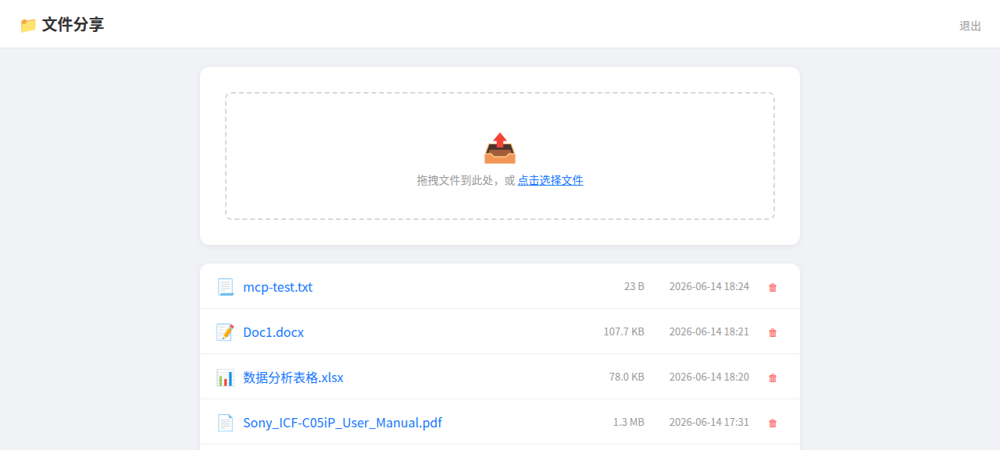

# Files.huaguo.site — Simple File Sharing & MCP Server

A dual-mode file sharing server with a web UI and an MCP (Model Context Protocol) interface for AI agents.

## Features

### Web File Sharing
- Password-protected upload/download/delete
- Drag-and-drop file upload with progress bar
- 500MB per-file limit
- Session-based authentication

### MCP Server (for AI Agents)
- **5 MCP tools**: list_files, upload_file, download_file, delete_file, get_file_info
- Streamable HTTP + SSE transport modes
- API key authentication

## Screenshot



## Quick Start

### Prerequisites
- Node.js 18+
- A Unix-like system

### Install
```bash
git clone https://github.com/wutao667/files-huaguo-site.git
cd files-huaguo-site
npm install
```

### Configure
```bash
export FILE_PASSWORD="your-s…word"
```

### Run
```bash
npm start          # Web UI on port 3100
npm run start:mcp  # MCP server on port 3101
```

## Web UI
Open `http://localhost:3100` — login with password, then drag & drop to upload.

## MCP API

### Streamable HTTP
```bash
# Initialize session
curl -X POST http://localhost:3101/mcp \
  -H "Content-Type: application/json" \
  -H "Accept: application/json, text/event-stream" \
  -H "x-api-key: ***" \
  -d '{"jsonrpc":"2.0","method":"initialize","params":{"protocolVersion":"2025-03-26","capabilities":{},"clientInfo":{"name":"agent","version":"1.0"}},"id":1}'

# List files (use session-id from initialize)
curl -X POST http://localhost:3101/mcp \
  -H "Content-Type: application/json" \
  -H "mcp-session-id: <session-id>" \
  -H "x-api-key: ***" \
  -d '{"jsonrpc":"2.0","method":"tools/call","params":{"name":"list_files","arguments":{}},"id":2}'
```

### MCP Tools
| Tool | Description |
|------|-------------|
| list_files | List all uploaded files |
| upload_file | Upload file from base64 content |
| download_file | Download file as base64 |
| delete_file | Delete a file |
| get_file_info | Get file metadata |

## Project Structure
```
.
├── index.html
├── screenshot.png
├── server/
│   ├── package.json
│   ├── server.js              # Express web server (port 3100)
│   ├── files-mcp-server.js    # MCP server (port 3101)
│   └── files-mcp-server.service
├── skill/
│   └── SKILL.md               # OpenClaw agent skill
├── uploads/                   # Uploaded files (gitignored)
└── .gitignore
```

## Tech Stack
Node.js, Express.js, @modelcontextprotocol/sdk, multer, bcryptjs

## License
MIT
